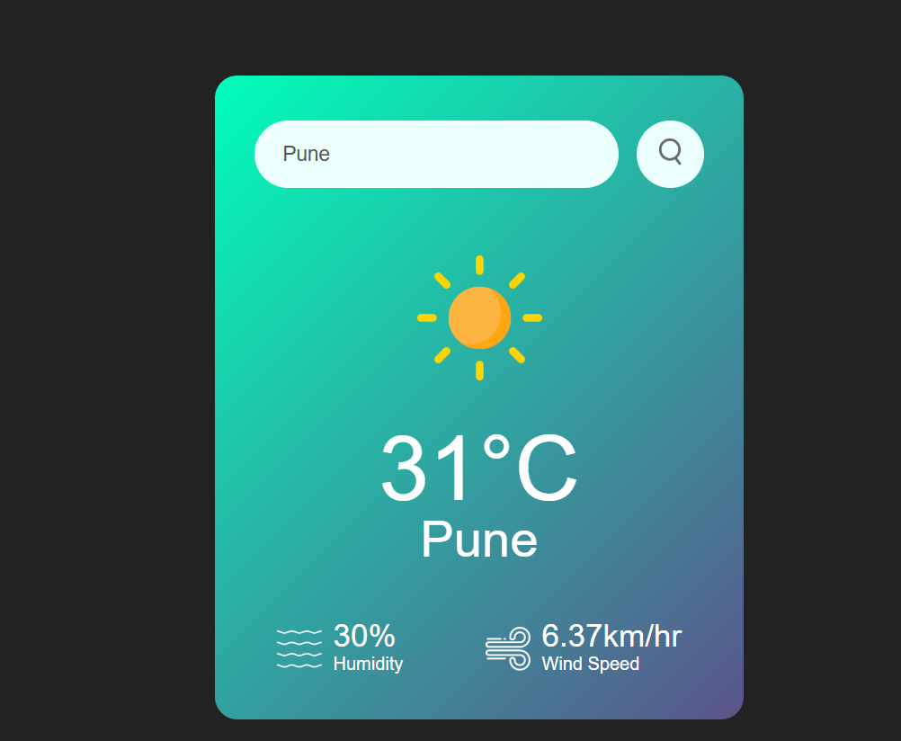

# 🌤️ Weather App

A simple and responsive weather application built using **HTML**, **CSS**, and **JavaScript** that fetches real-time weather data using the **OpenWeatherMap API**.

### 🔗 Live Demo
👉 [Click here to view the live app](https://siddhesh-kulkarni.github.io/Weather-App/)

## 📸 Preview




## 🚀 Features

- 🔍 Search weather by city name
- 🌡️ Displays current temperature, humidity, and wind speed
- 🖼️ Dynamic weather icons based on current conditions
- ⚠️ Error handling for invalid city names
- 📱 Responsive design

## 🛠️ Technologies Used

- HTML5
- CSS3
- JavaScript (ES6)
- [OpenWeatherMap API](https://openweathermap.org/api)

## ⚙️ How to Use

1. Clone the repository:

```bash
git clone https://github.com/siddhesh-kulkarni/Weather-App.git
cd Weather-App
